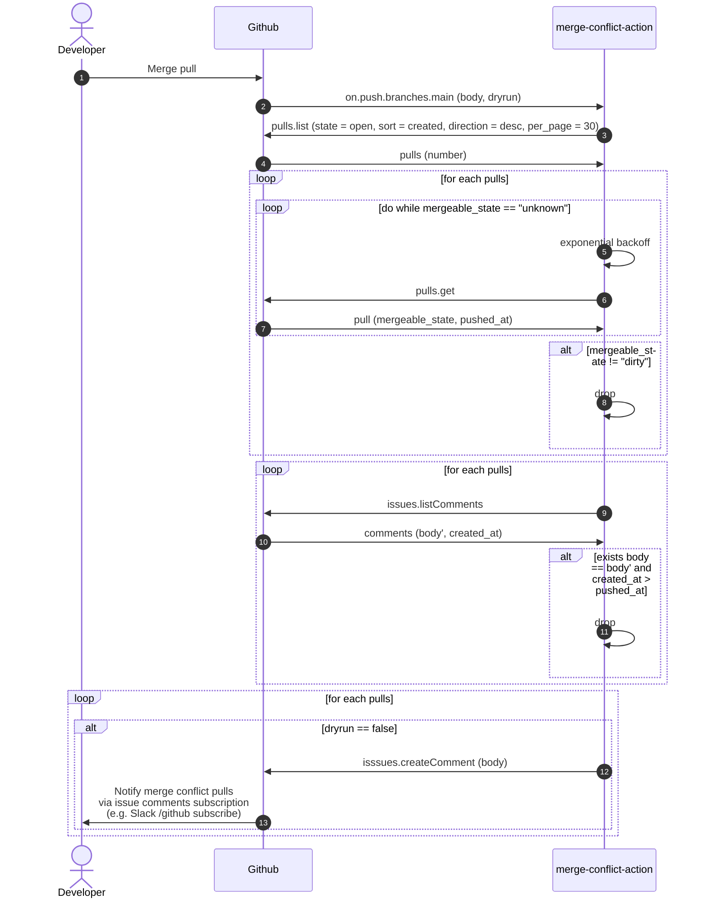

# merge-conflict-action
Github Action to notify merge conflict pulls 

## Usage
```yaml
name: Notify merge conflict pulls

on:
  push:
    branches:
    - main

jobs:
  notify:
    runs-on: ubuntu-latest
    steps:
      - uses: actions/checkout@v2
      - uses: nokamoto/merge-conflict-action@v0.0.2
        with:
          owner: nokamoto
          repo: merge-conflict-action
          token: ${{ secrets.GITHUB_TOKEN }}
```

| inputs | description | required | default |
| --- | --- | --- | --- |
| owner | A string identifier of the owner to retrieve merge conflict pulls. | true | |
| repo | A string identifier of the repository to retrieve merge conflict pulls. | true | |
| token | A string token to authenticate to Github. | true | |
| body | A string body to create issue comments. | false | `"Merge Conflict found"` |
| dryrun | A boolean to indicate whether the action creates actual issue comments. | false | `"false"` |

## How does it works?


- [pulls.list](https://docs.github.com/en/rest/reference/pulls#list-pull-requests)
- [pulls.get](https://docs.github.com/en/rest/reference/pulls#get-a-pull-request)
- [issues.listComments](https://docs.github.com/en/rest/reference/issues#list-issue-comments)
- [issues.createComment](https://docs.github.com/en/rest/reference/issues#create-an-issue-comment)

## Build

```bash
npm run all
```

Test, lint, format, and build `dist/index.js`.

### Release

Manual. Use the Github release web interface with auto-generate release notes.
